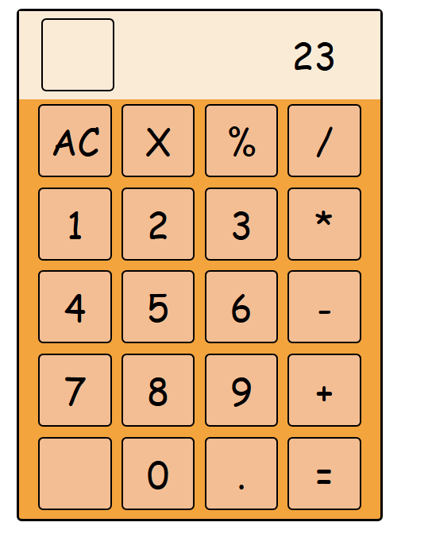

# 🔢 Calculator App

A simple and responsive calculator built using HTML, CSS, and JavaScript. It performs basic arithmetic operations and provides a clean, user-friendly interface. Great for practicing DOM manipulation and JavaScript logic.

---

## 🚀 Features

- Basic arithmetic operations: addition, subtraction, multiplication, division
- Real-time input and result display
- Clear and delete functionality
- Responsive design for mobile and desktop
- Clean UI with interactive button effects

---

## 📁 Project Structure

calculator/  
├── index.html  
├── style.css  
└── calculate.js  

- `index.html`: Markup for the calculator layout
- `style.css`: Styling for the calculator interface
- `calculate.js`: Logic to handle button inputs and calculations

---

## 🛠️ Tech Stack

- HTML5
- CSS3
- JavaScript (ES6)

---

## 📷 Screenshots

---

